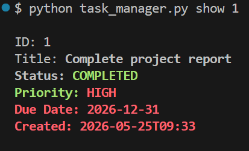
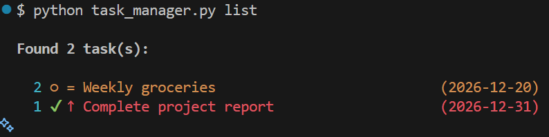

# CLI Task Manager with SQLite

A command-line task manager that stores tasks persistently in a SQLite database. Supports adding, listing, updating, completing, and deleting tasks via intuitive subcommands, with colored terminal output powered by `colorama`.

---

## 📸 Sample Output



> Screenshot showing `list` and `show` command output with colored statuses and priorities.

---

## ⚙️ Features

- **Persistent storage** — tasks saved to `~/.task_manager/tasks.db` via SQLite
- **Full CRUD** — add, list, show, update, complete, and delete tasks
- **Filtering** — filter by status, priority, or due date
- **Colored output** — status and priority color-coded via `colorama`
- **Overdue highlighting** — past-due tasks highlighted in bright red
- **Input validation** — date format checked before writing to DB
- **Safe queries** — parameterized SQL to prevent injection

---

## 🛠️ Tech Stack

| Tool / Library | Purpose |
|---|---|
| Python 3.10+ | Core language |
| `sqlite3` | Built-in database module |
| `argparse` | CLI subcommand parsing |
| `pathlib` | Cross-platform path handling |
| `datetime` | Date validation and comparison |
| `colorama` | Cross-platform colored terminal output |

---

## 📦 Installation

**1. Clone the repository**
```bash
git clone https://github.com/your-username/cli-task-manager.git
cd cli-task-manager
```

**2. Install dependency**
```bash
pip install colorama
```

**3. Make executable (optional)**
```bash
chmod +x task_manager.py
```

---

## 🚀 Usage

### Add a task
```bash
python task_manager.py add "Finish project report" --priority high --due 2026-12-31
python task_manager.py add "Buy groceries" --due 2026-06-01 -d "Milk, eggs, bread"
python task_manager.py add "Read a book" --priority low
```

### List tasks
```bash
# List all tasks
python task_manager.py list

# Filter by status
python task_manager.py list --status pending

# Filter by priority
python task_manager.py list --priority high

# Tasks due on or before a date
python task_manager.py list --due-before 2026-06-30

# Limit results
python task_manager.py list -n 5
```

### Show task details
```bash
python task_manager.py show 1
```

### Update a task
```bash
python task_manager.py update 1 --title "Updated title" --priority medium
python task_manager.py update 1 --due 2026-07-01
```

### Mark as complete
```bash
python task_manager.py complete 1
```

### Delete a task
```bash
python task_manager.py delete 1          # Prompts for confirmation
python task_manager.py delete 1 --force  # Skips confirmation
```

---

## 📋 Sample Terminal Session

```bash
$ python task_manager.py add "Finish project report" --priority high --due 2026-05-30
✓ Task added with ID: 1

$ python task_manager.py add "Buy groceries" --due 2026-06-01 --priority medium
✓ Task added with ID: 2

$ python task_manager.py add "Read a book" --priority low
✓ Task added with ID: 3

$ python task_manager.py list
Found 3 task(s):

  1 ○ ↑ Finish project report                     (2026-05-30)
  2 ○ = Buy groceries                              (2026-06-01)
  3 ○ ↓ Read a book

$ python task_manager.py show 1

ID: 1
Title: Finish project report
Status: PENDING
Priority: HIGH
Due Date: 2026-05-30
Created: 2026-05-25T10:30

$ python task_manager.py complete 1
✓ Task 1 marked as completed.

$ python task_manager.py list --status pending
Found 2 task(s):

  2 ○ = Buy groceries                              (2026-06-01)
  3 ○ ↓ Read a book

$ python task_manager.py delete 3
Are you sure you want to delete task 3? [y/N] y
✓ Task 3 deleted.
```

> **Note:** Colors are visible in the actual terminal. See screenshot above.

---

## 🗂️ Project Structure

```
cli-task-manager/
├── task_manager.py     # Main script
├── screenshots/
│   └── sample_output.png
└── README.md
```

---

## 💡 Concepts Demonstrated

| Concept | Implementation |
|---|---|
| SQLite integration | `sqlite3` module with context managers |
| CRUD operations | Parameterized queries for safe DB interaction |
| Dynamic updates | `UPDATE` statement built from `**kwargs` |
| CLI subcommands | `argparse` subparsers with `set_defaults(func=...)` |
| Colored output | `colorama` Fore/Style with graceful fallback |
| Date validation | `datetime.strptime` for ISO date checking |
| Overdue detection | Comparing due date against `date.today()` |
| Path handling | `pathlib.Path` replacing `os.path` |
| Row factory | `sqlite3.Row` for dict-like row access |
